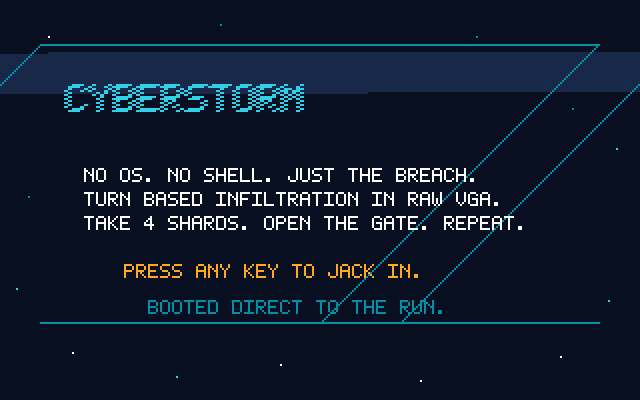
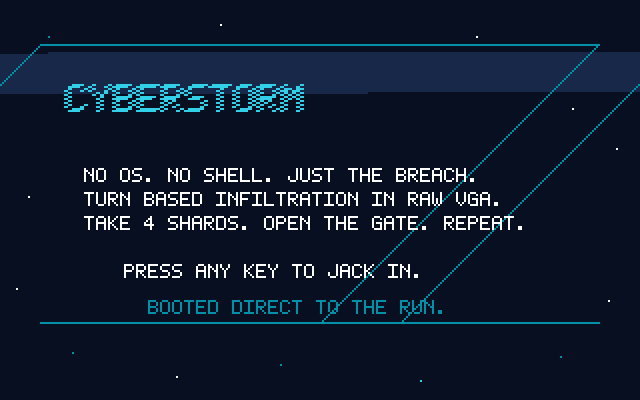
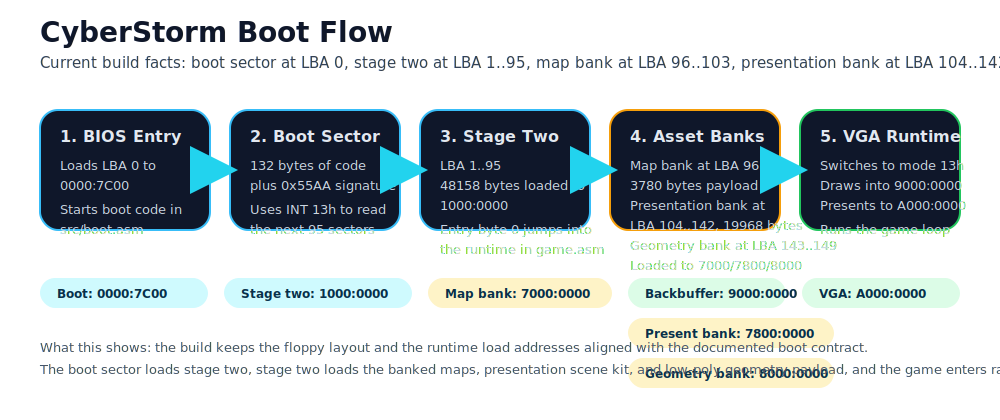
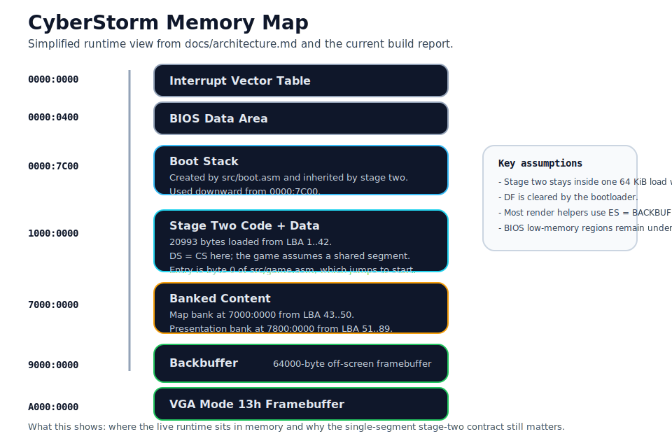
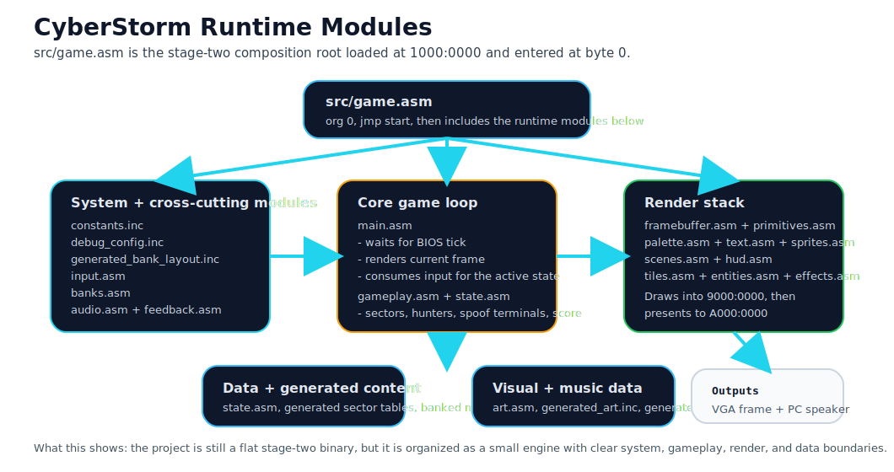
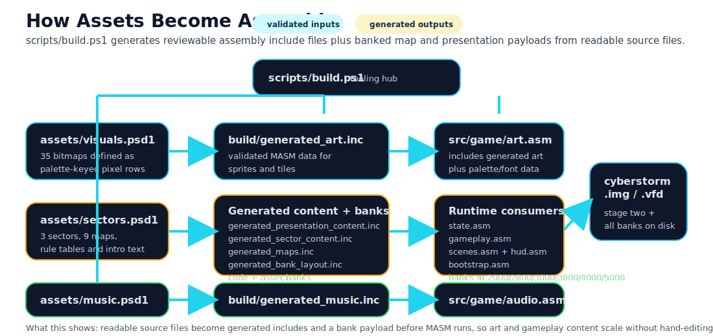

# CyberStorm

> No OS. No shell. Just the breach.
>
> CyberStorm is a bootable 16-bit x86 infiltration game and a compact bare-metal engine project. It boots from a floppy image, enters a hand-written boot sector, loads a real-mode stage two, switches into raw VGA mode `13h`, and runs without DOS or any host runtime.



| Built for | Boots from | Video | Runtime |
| --- | --- | --- | --- |
| BIOS x86 + Oracle VirtualBox | Raw floppy image (`.img` / `.vfd`) | VGA mode `13h` | 16-bit real mode |

## Key Features

### For Players

- **Three distinct sectors.** `Scout Grid`, `Surge Furnace`, and `Warden Lock` each push a different mix of routing, hazard, and pursuit pressure.
- **Readable turn-based tension.** You move once, hunters answer once, and every bad turn is meant to stay understandable.
- **Tactical systems without control bloat.** EMP pulses, surge nodes, spoof terminals, gate states, and elite hunters all live inside the same compact loop.
- **A real arcade-style mastery layer.** Runs now track score, sector performance, and final rank without replacing the survival objective.
- **A real attract mode.** If the title sits idle, CyberStorm boots into deterministic demo runs authored from source data instead of hand-coded one-off logic.

### For Engine People

- **A real boot path.** The build emits a bootable floppy image, not a host app wrapped in a fake shell.
- **A compact but structured runtime.** Stage two stays inside a documented single-segment contract while still using modular render, gameplay, audio, and data layers.
- **Generated content tooling.** Sprites, sectors, rules, demos, and music come from readable source files that generate MASM-friendly data at build time.
- **Disciplined validation.** The build enforces boot/image layout, generated content shape, deterministic debug options, and a lightweight balance harness.

## Visual Gallery

The README gallery is intentionally small. The build maintains three stable slots so the page stays curated instead of turning into a screenshot dump.

| Title / Identity | Live Gameplay | Payoff / Systems |
| --- | --- | --- |
|  |  |  |
| The first shot should immediately communicate "bootable game" through the splash or main title. | The middle shot should show the runner, hunters, HUD, and objective pressure in one readable frame. | The last shot should show a memorable beat: gate unlock, hazard interaction, sector transition, or end-state reveal. |

If you want the build to auto-pick better captures, name files with tags like `*-title-*`, `*-gameplay-*`, `*-hazard-*`, `*-elite-*`, `*-ending-*`, or `*-technical-*`.

## How It Works

CyberStorm is small enough to inspect, but it is no longer a single opaque assembly file. The diagrams below show the project as it exists in the current build.

### Boot Path



The boot sector at `LBA 0` loads stage two from `LBA 1..37` into `1000:0000`, then stage two loads the current map bank from `LBA 38..45` into `7000:0000` before entering VGA gameplay.

### Runtime Layout





The runtime keeps BIOS-owned low memory untouched, inherits the boot stack at `0000:7C00`, runs stage two from a single segment at `1000:0000`, and uses a backbuffer at `9000:0000` before presenting to VGA memory at `A000:0000`.

### Asset And Content Pipeline



[assets/visuals.psd1](assets/visuals.psd1), [assets/sectors.psd1](assets/sectors.psd1), [assets/demos.psd1](assets/demos.psd1), and [assets/music.psd1](assets/music.psd1) are the readable source of truth. [scripts/build.ps1](scripts/build.ps1) turns them into generated includes and a banked map payload that the runtime can load after boot.

## Quickstart

### Build The Release Image

```powershell
powershell -ExecutionPolicy Bypass -File .\scripts\build.ps1
```

### Boot It In VirtualBox

1. Create a BIOS-based VM such as `Other/Unknown (32-bit)`.
2. Keep or add a floppy controller.
3. Attach [build/cyberstorm.vfd](build/cyberstorm.vfd) as the floppy disk.
4. Boot the VM.

### Use The Included Workspace VM

Register the reusable VM:

```powershell
powershell -ExecutionPolicy Bypass -File .\scripts\deploy-vm.ps1
```

Launch it:

```powershell
powershell -ExecutionPolicy Bypass -File .\scripts\start-vm.ps1
```

If you leave the title screen alone for a few seconds, CyberStorm now auto-starts an authored attract/demo run. Press any key during the demo to jump into a fresh live run.

## Technical Facts

These values come from the current [build/cyberstorm-build-report.txt](build/cyberstorm-build-report.txt).

| Fact | Current build |
| --- | --- |
| Boot code | `132 / 510` bytes |
| Stage two | `18942` bytes across `37` sectors |
| Banked map payload | `3780` bytes across `8` sectors |
| Bank LBA range | `38..45` |
| Content set | `3` sectors, `9` maps, `3` demos, `5` music themes |
| Balance sweep | `36` deterministic scenarios |
| Video target | `320x200x256` in VGA mode `13h` |
| Runtime model | Single-segment `16-bit` real mode |

## Why This Is A Strong AI-Assisted Development Example

CyberStorm is a good AI-assisted project for a specific reason: the repository gives automated iteration clear boundaries. The interesting part is not "AI wrote some assembly." The interesting part is that the repo makes it practical to use AI on a bare-metal codebase without letting that become reckless.

- **The source of truth is readable.** Visuals, sector layouts, sector rules, demos, and music live in compact authored files instead of sprawling raw assembly data.
- **The runtime contracts are explicit.** [docs/architecture.md](docs/architecture.md) spells out the boot handoff, segment assumptions, memory map, state layout, and bank-loading rules.
- **The build enforces the dangerous constraints.** [scripts/build.ps1](scripts/build.ps1) validates boot-sector size, the single-segment stage-two limit, bank layout, floppy footprint, and generated content shape before writing the image.
- **Debugging can be reproduced.** Deterministic debug flags can force a known RNG seed, start in a chosen sector, and enable a compact overlay.
- **Balance changes get guardrails.** [scripts/balance-harness.ps1](scripts/balance-harness.ps1) runs static fairness checks and fixed-seed spawn sweeps before someone boots VirtualBox.
- **Design intent is written down.** [docs/sector-identity.md](docs/sector-identity.md) and [docs/enemy-drama.md](docs/enemy-drama.md) explain what sectors and enemies are supposed to feel like, not just how they are coded.

Repo artifacts that support that claim:

- [assets/visuals.psd1](assets/visuals.psd1), [assets/sectors.psd1](assets/sectors.psd1), [assets/demos.psd1](assets/demos.psd1), and [assets/music.psd1](assets/music.psd1)
- [build/generated_art.inc](build/generated_art.inc), [build/generated_sector_content.inc](build/generated_sector_content.inc), [build/generated_maps.inc](build/generated_maps.inc), [build/generated_demos.inc](build/generated_demos.inc), and [build/generated_music.inc](build/generated_music.inc)
- [docs/architecture.md](docs/architecture.md), [docs/sector-identity.md](docs/sector-identity.md), and [docs/enemy-drama.md](docs/enemy-drama.md)
- [scripts/build.ps1](scripts/build.ps1) and [scripts/balance-harness.ps1](scripts/balance-harness.ps1)
- [build/cyberstorm-build-report.txt](build/cyberstorm-build-report.txt) and [build/cyberstorm-balance-report.txt](build/cyberstorm-balance-report.txt)

## Build, Debug, And Validation

### Prerequisites

- Windows PowerShell
- MASM `ml.exe` from Visual Studio or Visual Studio Build Tools with the MSVC x86/x64 toolset

If MASM is installed somewhere unusual:

```powershell
powershell -ExecutionPolicy Bypass -File .\scripts\build.ps1 -MasmPath 'C:\path\to\ml.exe'
```

There is also an experimental MASM-compatible path for tools like `UASM` or `JWasm`:

```powershell
powershell -ExecutionPolicy Bypass -File .\scripts\build.ps1 -Assembler uasm -AssemblerPath 'C:\path\to\uasm.exe'
```

That path is not the default and is only expected to work with assemblers that accept MASM-style source and emit compatible `16-bit` COFF output.

### Deterministic Debug Build

```powershell
powershell -ExecutionPolicy Bypass -File .\scripts\build.ps1 `
  -DebugBuild `
  -DebugSeed 4660 `
  -DebugOverlay `
  -DebugStartInGame `
  -DebugStartSector 2
```

Useful switches:

- `-DebugSeed <0..65535>` forces the same `16-bit` RNG seed on every new run
- `-DebugOverlay` shows compact live state in-game
- `-DebugStartInGame` skips splash/title and boots directly into a run
- `-DebugStartSector <n>` starts every new run from a chosen sector

### Balance Harness

```powershell
powershell -ExecutionPolicy Bypass -File .\scripts\balance-harness.ps1
```

The harness checks:

- walkable start-to-exit paths for every authored map
- placement slack for shards, surges, terminals, and enemies
- safe-zone pressure constraints
- sector rule sanity
- deterministic spawn mixes and nearest-enemy pressure across fixed seeds

### Replay Harness

```powershell
powershell -ExecutionPolicy Bypass -File .\scripts\replay-harness.ps1
```

The replay harness turns the authored attract demos into deterministic gameplay smoke tests:

- replays the same seeded sector loads the title demos use
- simulates movement, EMP use, hunter turns, spoof routing, surge hits, sector exits, and scoring
- compares the observed end state against the `Expected` block stored beside each demo in [assets/demos.psd1](assets/demos.psd1)
- writes a report with suggested replacement expectation blocks if an intentional gameplay change shifted the result

The normal build runs this automatically and writes [build/cyberstorm-replay-report.txt](build/cyberstorm-replay-report.txt).

### Regression Harness

```powershell
powershell -ExecutionPolicy Bypass -File .\scripts\regression-harness.ps1
```

The regression harness checks the binary/runtime contract that is easiest to accidentally break in assembly work:

- boot sector size and `0x55AA` signature
- `GAME_SECTORS` vs the actual stage-two sector count
- stage-two entry byte `0` still contains an intentional executable handoff
- `.img` and `.vfd` byte-for-byte equality
- stage-two and bank payload placement at the correct LBA ranges
- zero-filled sector padding and unused floppy tail
- presence of `boot.lst` and `game.lst` for post-failure inspection

The normal build runs this automatically and writes [build/cyberstorm-regression-report.txt](build/cyberstorm-regression-report.txt).

### Key Build Outputs

- [build/cyberstorm.img](build/cyberstorm.img)
- [build/cyberstorm.vfd](build/cyberstorm.vfd)
- [build/cyberstorm-boot.bin](build/cyberstorm-boot.bin)
- [build/cyberstorm-stage2.bin](build/cyberstorm-stage2.bin)
- [build/generated_art.inc](build/generated_art.inc)
- [build/generated_sector_content.inc](build/generated_sector_content.inc)
- [build/generated_maps.inc](build/generated_maps.inc)
- [build/generated_demos.inc](build/generated_demos.inc)
- [build/generated_music.inc](build/generated_music.inc)
- [build/generated_bank_layout.inc](build/generated_bank_layout.inc)
- [build/cyberstorm-map-bank.bin](build/cyberstorm-map-bank.bin)
- [build/cyberstorm-replay-report.txt](build/cyberstorm-replay-report.txt)
- [build/cyberstorm-balance-report.txt](build/cyberstorm-balance-report.txt)
- [build/cyberstorm-regression-report.txt](build/cyberstorm-regression-report.txt)
- [build/boot.lst](build/boot.lst)
- [build/game.lst](build/game.lst)
- [build/debug_config.inc](build/debug_config.inc)
- [build/cyberstorm-build-report.txt](build/cyberstorm-build-report.txt)

### Best Files To Inspect When Something Breaks

- [build/boot.lst](build/boot.lst): bootloader assembly listing
- [build/game.lst](build/game.lst): stage-two assembly listing
- [build/generated_art.inc](build/generated_art.inc): generated sprite/tile data as MASM sees it
- [build/generated_demos.inc](build/generated_demos.inc): generated attract-mode scripts as MASM sees them
- [build/generated_bank_layout.inc](build/generated_bank_layout.inc): runtime bank metadata
- [build/cyberstorm-map-bank.bin](build/cyberstorm-map-bank.bin): raw post-boot map payload
- [build/cyberstorm-replay-report.txt](build/cyberstorm-replay-report.txt): deterministic replay smoke summary and suggested expectation updates
- [build/cyberstorm-balance-report.txt](build/cyberstorm-balance-report.txt): fairness and deterministic sweep summary
- [build/cyberstorm-regression-report.txt](build/cyberstorm-regression-report.txt): boot/image contract summary for the shipped floppy artifacts
- [build/cyberstorm-build-report.txt](build/cyberstorm-build-report.txt): layout, addresses, warnings, and artifact paths
- [build/cyberstorm-stage2.bin](build/cyberstorm-stage2.bin): flattened stage-two payload exactly as written after the boot sector

## Project Guide

- Runtime and memory-layout contracts: [docs/architecture.md](docs/architecture.md)
- Sector identity: [docs/sector-identity.md](docs/sector-identity.md)
- Hunter behavior and telegraphing: [docs/enemy-drama.md](docs/enemy-drama.md)
- Tactical spoof terminals: [docs/spoof-terminals.md](docs/spoof-terminals.md)
- Mastery score and rank rules: [docs/mastery-score.md](docs/mastery-score.md)
- Content-generation pipeline: [docs/content-pipeline.md](docs/content-pipeline.md)
- Asset-bank design: [docs/asset-banks.md](docs/asset-banks.md)
- Balance harness: [docs/balance-harness.md](docs/balance-harness.md)
- Replay harness: [docs/replay-harness.md](docs/replay-harness.md)
- Assembler-path notes: [docs/assembler-paths.md](docs/assembler-paths.md)

## Scope And Truth-In-Advertising

- CyberStorm is OS-independent in the sense that it boots directly on the target machine or VM and does not rely on a host kernel, filesystem, or runtime.
- It is not firmware- or architecture-universal. The current image targets BIOS-style x86 booting, which is the right fit for VirtualBox.
- The build intentionally preserves the current boot contract: boot sector at `LBA 0`, stage two immediately after it at `LBA 1`, loaded by the bootloader to `1000:0000`.
